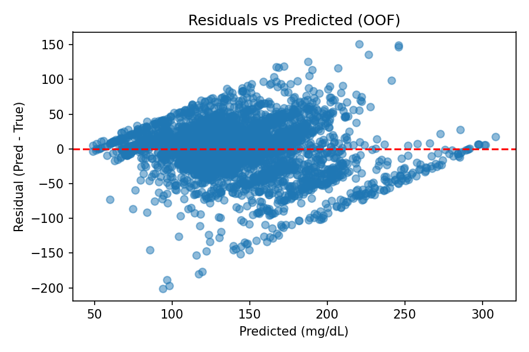
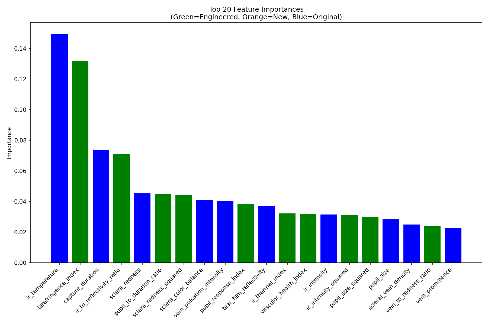

## EyeBloodGlucose
Moonshot to measure blood glucose from your eyes
https://github.com/jtb21091/Cherry/tree/main

Best Model: Random Forest with R² Score: 0.55870
2025-02-01 17:47:13,947 - INFO - Best model saved as: eye_glucose_model.pkl

python3 -m venv venv
source venv/bin/activate
pip install -r requirements.txt
python model.py

## Steps

# 1) run the model as much as possible
# 2) this then spits the data into labels.csv file (add in the blood glucose data)
# 3) train the model
# 4) run the prediction

## One canonical dataset (labels.csv) and auto-updated charts

Training can now clean the data and overwrite the canonical `eye_glucose_data/labels.csv` (with a timestamped backup), so there’s only one dataset in the repo.

- Cleaning rules: remove ±6σ outliers (per feature) and, in “strong” mode, drop rows containing zeros or exact maxima in any numeric column (with safety guards so sparse new columns aren’t over-filtered).
- After training, plots are auto-written to `pngfiles/` so the README images always reflect your latest run:
  - `pngfiles/2.png` – Residuals vs Predicted (OOF)
  - `pngfiles/3.png` – Predicted vs Actual (OOF)
  - `pngfiles/4.png` – Top Feature Importances

Quick run (cleans, overwrites labels.csv, removes intermediates, and trains fast):

```
python EyeBloodGlucose/training.py \
  --preclean strong \
  --overwrite-labels \
  --cleanup-clean-files \
  --fast \
  --no-show
```

Notes:
- A backup is created as `eye_glucose_data/labels.csv.backup_YYYYmmdd_HHMMSS` the first time you overwrite.
- Omit `--fast` for a deeper search.


# Best Model Metrics

Below are the metrics for the best model compared to CGM benchmarks:

| Metric       | Best Model Value | CGM Benchmark |
|--------------|------------------|---------------|
| R²           | 0.49             | 0.94          |
| MSE          | 474              | 6.2           |
| MAE          | 16               | 2.1           |
| MARD         | 15%              | 10.5%         |
| Sigma Level  | 0.59             | 3.0           |


##






