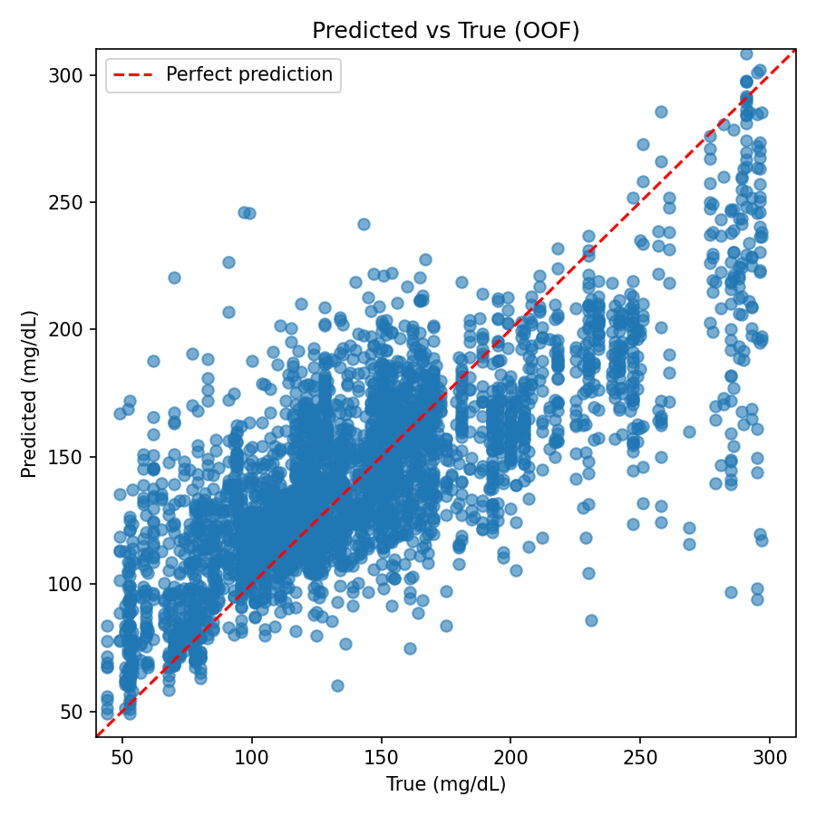

## EyeBloodGlucose
Moonshot to measure blood glucose from your eyes
https://github.com/jtb21091/Cherry/tree/main
Best Model: Random Forest with R² Score: 0.55870
2025-02-01 17:47:13,947 - INFO - Best model saved as: eye_glucose_model.pkl

## Steps

# 1) run the model as much as possible
# 2) this then spits the data into labels.csv file (add in the blood glucose data)
# 3) train the model
# 4) run the prediction

# Best Model Metrics

Below are the metrics for the best model compared to CGM benchmarks:

| Metric       | Best Model Value | CGM Benchmark |
|--------------|------------------|---------------|
| R²           | 0.49             | 0.94          |
| MSE          | 474              | 6.2           |
| MAE          | 16               | 2.1           |
| MARD         | 15%              | 10.5%         |
| Sigma Level  | 0.59             | 3.0           |

##

